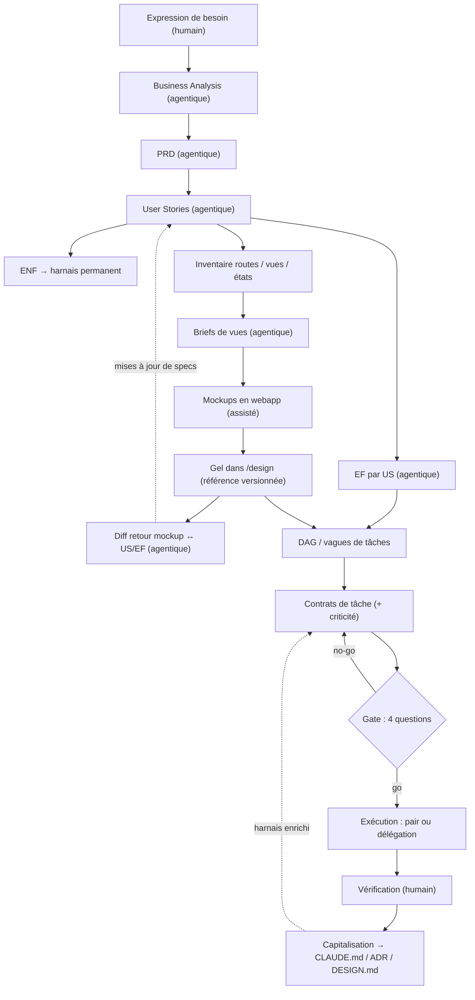

# Cycle de vie de développement agentique — note de référence

**Objet.** Décrire de bout en bout le cycle de développement pour des projets greenfield menés en solo avec des agents de code, à valider sur un premier projet pilote avant généralisation. La note consolide la construction élaborée en conversation avec trois greffons retenus de la masterclass « Agentic Engineering » — signalés `[greffon]` dans le texte — en écartant le registre démonstratif de la source (les métriques de type « SaaS en 48 h » ne sont pas des hypothèses de travail ici).

**Statut.** Version 1, non éprouvée en conditions réelles. Les décisions établies et les points ouverts sont distingués ; les points ouverts sont regroupés en §8.

---

## 1. Principes directeurs

**Déplacement de la valeur.** Quand l'exécution devient bon marché — un agent produit du code vite et en volume — la valeur migre aux deux extrémités du cycle : la spécification en amont, la vérification en aval. Écrire le code cesse d'être le goulot d'étranglement ; la capacité à spécifier précisément et à vérifier honnêtement devient le facteur limitant. Tout le cycle décrit ici découle de ce déplacement.

**Réduction progressive des libertés.** Chaque artefact amont réduit l'espace des choix disponibles en aval : la Business Analysis fixe le problème, le PRD le périmètre, les US le comportement, les EF le détail vérifiable, les ENF les contraintes transversales, le mockup gelé le rendu. Corollaire : quand un agent « prend des libertés » (UI générique, routage improvisé, comportement inventé), ce n'est pas une faute de l'agent mais un vide de contrainte. Le texte seul sous-détermine l'UI ; l'agent comble les vides avec ses priors. La réponse est toujours structurelle — ajouter la contrainte manquante — jamais incantatoire (répéter la consigne plus fort).

**Séparation divergence / convergence.** L'exploration créative s'épuise dans des espaces dédiés (la webapp pour les mockups, la conversation pour les specs) _avant_ l'exécution. L'agent d'exécution ne reçoit que des cibles fermées : il ne dessine pas, il transpose ; il ne décide pas, il implémente. Toute décision prise pendant l'exécution est un signal de spec incomplète.

**Trois régimes de production.** Chaque artefact du cycle relève d'un régime explicite — humain, assisté ou agentique (§2). L'assignation d'un artefact à un régime est elle-même une décision d'architecture du cycle, motivée et révisable.

**Le repo comme mémoire externe.** Quand l'agent écrit une part majoritaire du code, la connaissance du système migre de la tête vers le repo. Les specs, ADRs et docs de harnais cessent d'être de la documentation : ce sont la mémoire de travail externalisée. La question de fin de session n'est pas « est-ce que ça marche » mais « est-ce que je comprends encore ce système ». La dette de compréhension est le risque de fond du dev solo agentique (§6).

**La maîtrise comme variable à défendre.** La matrice autonomie × maîtrise `[greffon]` sert de grille d'auto-audit, pas de typologie : on ne quitte pas le quadrant « autonomie élevée / maîtrise élevée » en changeant d'outillage, mais par érosion silencieuse de la maîtrise — lancer plusieurs agents en parallèle peut toujours relever du vibe coding si le contrôle qualité s'est relâché. L'audit est périodique (§6).

---

## 2. Les trois régimes de production

|Régime|Définition|Artefacts concernés|Justification|
|---|---|---|---|
|**Humain**|Production sans IA rédactrice (au plus une IA maïeutique, voir ci-dessous)|Expression de besoin ; arbitrages et validations tout au long du cycle ; vérification finale|Ancrage épistémique : le besoin est le seul point où l'information entre dans le système depuis l'extérieur. Tout le reste est dérivation. Si l'IA co-rédige l'origine, boucle auto-référentielle : l'IA spécifie ce que l'IA construira, et l'humain valide du plausible.|
|**Assisté**|IA générative en boucle interactive serrée, hors boucle agentique et hors repo|Mockups (génération en webapp Claude, itération conversationnelle)|La boucle visuelle instantanée (artifact rendu immédiatement, itération « plus dense », « montre l'état vide ») est le bon outil pour épuiser la divergence. L'exploration ne pollue pas le repo.|
|**Agentique**|Un agent produit, l'humain valide et arbitre|BA, PRD, US, EF, ENF, briefs de vues, diff retour mockup ↔ specs, DAG, exécution du code, revue outillée, capitalisation|Levier de volume, contraint par le harnais (§5). Le rôle humain passe de rédacteur à valideur — mais la cohérence inter-artefacts reste un travail humain, et c'est le vrai poste de charge.|

**Exception maïeutique (régime humain).** Un agent peut intervenir sur l'expression de besoin en rôle strictement maïeutique : interviewer, détecter les ambiguïtés, poser les questions non posées — sans jamais tenir le stylo. Le texte final est écrit à la main.

---

## 3. Vue d'ensemble du pipeline



Le pipeline se lit comme une alternance de régimes : humain (besoin) → agentique (chaîne d'artefacts) → assisté (mockups) → agentique (diff retour, exécution contrainte) → humain (vérification). Chaque transition de régime a son artefact de passage : le besoin, le brief, le mockup gelé, la PR.

**Anti cycle en V.** La chaîne complète ne se déroule pas intégralement avant la première ligne de code. Deux choses se font globalement, une fois, en amont : le harnais (DESIGN.md, ENF, conventions — l'infrastructure anti-libertés) et l'inventaire des routes. Le reste — US → EF → briefs → mockups → exécution — se déroule **par tranche verticale**, sinon le cycle devient un tunnel d'un trimestre avant tout code.

### Table maîtresse des phases

|#|Phase|Régime|Entrées|Sorties|Critère de sortie|
|---|---|---|---|---|---|
|1|Expression de besoin|humain|—|`besoin.md`|Un tiers (ou un agent) peut reformuler le problème sans rien inventer|
|2|Business Analysis|agentique|besoin|`ba.md`|Problème fermé : on sait ce qu'on ne résout pas ; alternatives tranchées|
|3|PRD|agentique|BA|`prd.md`|Périmètre et **non-objectifs** arbitrés ; critères de succès observables|
|4|User Stories|agentique|PRD|`us/US-xxx.md`|Étanches, critères d'acceptation, tranches verticales définies|
|5|Exigences fonctionnelles|agentique|US|`ef/EF-xxx.y.md`|Vérifiables mécaniquement (sinon : redécouper)|
|6|Exigences non fonctionnelles|agentique|BA + PRD|sections de `CLAUDE.md` / `DESIGN.md`|Intégrées au harnais, jamais recopiées par tâche|
|7|Inventaire des vues|agentique|US|`routes.md`|Toutes les routes et **tous les états** listés|
|8|Briefs de vues|agentique|US + EF + inventaire + DESIGN.md|`briefs/V-xx.md`|Préambule commun + états exhaustifs + contraintes de la cible|
|9|Mockups|assisté|briefs|itérations en webapp|Libertés épuisées ; validation visuelle humaine|
|10|Gel|—|mockup validé|`/design/V-xx/`|Référence versionnée, diffable, datée|
|11|Diff retour|agentique|mockup gelé + US/EF|mises à jour de specs|Aucun écart silencieux entre mockup et specs|
|12|DAG `[greffon]`|agentique|US + EF|`dag.md`|Dépendances explicites ; vagues parallélisables identifiées|
|13|Contrats de tâche|agentique|US + EF + mockup + DAG|`taches/T-xxx.md`|Critères exécutables + criticité fixée|
|14|Gate `[greffon]`|humain|contrat de tâche|go / no-go|Quatre réponses positives, sans exception|
|15|Exécution|agentique|contrat|branches, commits, PR|Critères verts + correspondance au mockup gelé|
|16|Vérification|humain|PR|validation|Ordre spec → tests → diff ; profondeur = f(criticité)|
|17|Capitalisation|agentique + humain|session terminée|CLAUDE.md / ADR / DESIGN.md enrichis|Apprentissages intégrés au harnais|

---

## 4. Les phases en détail

### 4.1 Expression de besoin — _humain_

Le point d'ancrage épistémique du cycle. Contenu attendu : le problème vécu (pas la solution), le contexte d'usage, les contraintes non négociables, et les intuitions de solution — présentes si elles existent, mais explicitement marquées comme intuitions, pas comme exigences. Rédaction manuelle, éventuellement précédée d'une session maïeutique avec un agent (questions, détection d'ambiguïtés, reformulations proposées oralement — le stylo reste humain).

Critère de sortie : un lecteur extérieur peut reformuler le problème sans avoir à inventer. Si l'agent de la phase suivante doit combler des trous pour produire la BA, le besoin retourne en rédaction.

### 4.2 Business Analysis — _agentique_

Draft par agent à partir du besoin : reformulation du problème, acteurs et usages, existant et alternatives — y compris l'alternative « ne rien construire » et « utiliser un outil existant », qui doivent être examinées et tranchées explicitement —, contraintes, risques. Arbitrage humain ligne à ligne : c'est ici que commence le vrai poste de charge humain du cycle, la cohérence inter-artefacts. Un draft plausible mais subtilement à côté du besoin coûte plus cher que pas de draft du tout.

### 4.3 PRD — _agentique_

Le PRD change de statut par rapport à sa version classique : de document d'intention, il devient contrat d'exécution. Trois sections portantes : le périmètre, les **non-objectifs** — aussi contraignants que les objectifs, c'est la première barrière anti-libertés du cycle : ce qui n'est pas dans le périmètre ne doit pas émerger « en bonus » d'une session d'agent —, et les critères de succès observables. Les hypothèses non validées sont listées comme telles.

### 4.4 User Stories — _agentique_

Étanches (une US ne dépend pas de l'implémentation d'une autre pour être comprise), avec critères d'acceptation, identifiées `US-xxx`. Le découpage se fait en tranches verticales livrant chacune un comportement complet de bout en bout — c'est l'unité de déroulement du reste du cycle. Draft par agent depuis le PRD, validation et re-découpage humains.

### 4.5 Exigences fonctionnelles — _agentique, destination : contrat de tâche_

Rattachées aux US (`EF-xxx.y`), elles portent le détail vérifiable du comportement. Règle de découpe, qui vaut critère de qualité : **si on ne peut pas vérifier mécaniquement qu'une EF est satisfaite, elle est mal découpée**. Une EF vérifiable mécaniquement = un test, une commande, une assertion, une comparaison de rendu. Les EF voyagent dans le contrat de tâche (§4.13) : elles sont locales à leur US.

### 4.6 Exigences non fonctionnelles — _agentique, destination : harnais permanent_

Distinction structurelle avec les EF : les ENF sont transversales — budgets de performance, accessibilité, sécurité, conventions de code, contraintes d'architecture (une interdiction actée par ADR — un motif de routage proscrit, par exemple — est une ENF au sens plein). Elles vivent dans le harnais (`CLAUDE.md`, `DESIGN.md`, ADRs), jamais recopiées dans les tâches. Raison : une ENF recopiée dans chaque tâche finit diluée puis ignorée ; une ENF dans le harnais s'applique partout, mécaniquement, à chaque session.

### 4.7 Inventaire des routes et des vues — _agentique_

Table `route → vue → états → US couvertes`, établie globalement avant tout mockup. Raison d'être : les libertés de l'agent se prennent d'abord sur les états — vide, chargement, erreur, données limites — que personne ne spécifie jamais spontanément. L'inventaire force l'exhaustivité des états au moment où elle coûte le moins cher. C'est aussi le document qui révèle les vues implicites (paramètres, onboarding, écrans d'erreur globaux) que les US ne mentionnent pas.

### 4.8 Briefs de vues — _agentique_

L'artefact pivot du cycle : celui qui franchit la frontière entre le monde du repo et le monde de la webapp. Rédigé par un agent à partir des US, EF, de l'inventaire et du DESIGN.md. Trois exigences pour qu'il tienne ce rôle :

1. **Préambule commun**, strictement identique en tête de chaque brief : tokens, inventaire fermé des composants autorisés, règles de layout. C'est la parade au risque structurel de la génération en webapp — la dérive stylistique entre conversations, chaque session repartant de zéro. Dix briefs sans préambule commun produisent dix vues de dix applications différentes.
2. **Contraintes de l'environnement cible** : les artifacts webapp sont du React single-file avec Tailwind core et un jeu de bibliothèques limité. Le brief borne la génération à l'**intersection** de ce qui existe dans les artifacts _et_ dans la stack finale du projet — sinon on valide des mockups intransposables.
3. **Exhaustivité des états** par vue, reprise de l'inventaire : vide, chargement, erreur, nominal avec données réalistes, cas limites. C'est là que les libertés se prenaient ; c'est là que le brief est le plus explicite.

Template complet en annexe A.

### 4.9 Mockups — _assisté (webapp)_

Génération en webapp Claude à partir des briefs, itération conversationnelle jusqu'à épuisement des libertés — c'est l'espace de divergence officiel du cycle. Discipline de session : les vues d'un même flux se génèrent dans la même conversation autant que possible (cohérence stylistique). Niveau de fidélité : **wireframe pour l'intégralité des vues, haute fidélité pour les trois ou quatre vues cœur seulement**. L'intégralité en haute fidélité est le piège du dev solo — coût quadratique, valeur marginale.

### 4.10 Gel — rapatriement dans le repo

Après validation visuelle, le mockup est rapatrié dans `/design` du repo : mockup-as-code (HTML ou React statique sans logique), versionné, diffable, daté. Le gel transforme le mockup en **référence exécutable** : il ferme la boucle de vérification UI qui manquait au cycle — screenshot Playwright de l'implémentation comparé à la référence, l'agent itère jusqu'à correspondance. L'UI acquiert un critère d'acceptation mécanique.

### 4.11 Diff retour mockup ↔ specs — _agentique_

Le point de discipline qui décide si le système tient dans la durée. L'itération visuelle fait émerger des choses que les US n'avaient pas prévues — un filtre nécessaire, un champ manquant, une navigation repensée. Si ces découvertes restent dans le mockup, les specs divergent silencieusement : le mockup devient source de vérité de facto pendant que les US pourrissent. Après chaque gel, un agent diffe le mockup contre les US/EF concernées et propose les mises à jour de specs correspondantes ; arbitrage humain. Chaque écart entre l'intention et le rendu laisse une trace remontante — c'est le réflexe provenance appliqué au design.

### 4.12 Planification — DAG et vagues `[greffon]`

Entre le découpage et l'exécution, un artefact explicite de planification : identifier les dépendances entre US/tâches pour constituer un graphe acyclique, puis regrouper les tâches indépendantes en **vagues** parallélisables. C'est ce qui justifie l'infrastructure de parallélisation (worktrees) : sans DAG, la parallélisation est un pari ; avec, c'est une lecture. Artefact minimal : une table `tâche | dépend de | vague` (annexe E).

### 4.13 Contrats de tâche

Le package que reçoit l'agent d'exécution, autosuffisant : US + EF concernées, mockup de référence gelé, critères d'acceptation exécutables, pointeurs vers les sections pertinentes du harnais, et un champ **criticité** `[greffon]` — basse / moyenne / haute. Auth, données, migrations, paiements, tout ce qui touche à l'intégrité ou à la sécurité : criticité haute par défaut. La criticité détermine mécaniquement deux choses en aval : le mode d'exécution (§4.15) et la profondeur de revue (§4.16). Template en annexe B.

### 4.14 Gate — les quatre questions `[greffon]`

Avant tout lancement d'agent, quatre questions, toutes exigeant une réponse positive :

1. L'objectif attribué à l'agent est-il explicite et sans ambiguïté ?
2. Les contraintes techniques et critères d'acceptation sont-ils formalisés ?
3. L'agent dispose-t-il des outils pour implémenter, tester et corriger de manière autonome ?
4. Suis-je en mesure d'expliquer, d'évaluer et de valider la solution finale ?

Les questions 1–2 auditent le contrat de tâche, la question 3 audite le harnais, la question 4 audite la dette de compréhension. Une réponse négative renvoie en amont — elle ne se contourne pas en « surveillant de plus près ».

### 4.15 Exécution — deux modes

**Pair** (interactif, présence continue) : pour l'exploratoire, le cœur du système, toute tâche de criticité haute. **Délégation** (plan proposé par l'agent → validé → autonomie avec checkpoints) : pour la criticité basse et le répétitif. Mécanique commune : branches ou worktrees jetables par vague, commits atomiques fréquents comme points de restauration, boucle UI screenshot ↔ mockup gelé jusqu'à correspondance. Le mode n'est jamais choisi à l'humeur : il découle de la criticité inscrite au contrat.

### 4.16 Vérification — _humain_

Le nouveau goulot du cycle, assumé comme tel. Ordre de revue strict : d'abord la conformité à la spec, ensuite l'honnêteté des tests — un agent sait écrire des tests qui valident son propre bug ; les tests se lisent comme du code suspect, pas comme des preuves —, enfin seulement le diff. **La profondeur de revue est fixée par la criticité inscrite au contrat, jamais par le track record récent de l'agent** : c'est la parade au cognitive drift `[greffon]` — la dérive naît des séries de succès, la confiance ne se capitalise pas entre tâches. Question de clôture de session : est-ce que je comprends encore ce système ? Une réponse hésitante déclenche une session de relecture sans production.

### 4.17 Capitalisation

Chaque session produit des apprentissages — erreurs récurrentes de l'agent, ambiguïtés de spec révélées, pièges d'environnement. Ils remontent dans le harnais : `CLAUDE.md` (pièges, conventions), ADRs (décisions), `DESIGN.md` (patterns UI). C'est le cycle de maturation appliqué au code : généré = brut/exploité, relu et documenté = capitalisé, extrait en pattern ou template = réutilisé. La boucle est fermée quand les échecs de l'agent améliorent la doc du repo — c'est-à-dire quand le harnais est _stateful_ là où chaque session d'agent est stateless.

---

## 5. Le harnais permanent

Le harnais est tout ce qui contraint l'agent sans figurer dans la tâche : la phase du cycle qui n'existait pas avant. Structure type du repo :

```
/CLAUDE.md              — conventions, commandes, ENF, pièges connus, boucles de vérification
/docs/
  adr/                  — décisions d'architecture (contraintes lisibles par l'agent)
  specs/
    besoin.md
    ba.md
    prd.md
    us/                 — US-xxx.md
    ef/                 — EF-xxx.y.md
    routes.md           — inventaire routes / vues / états
    briefs/             — V-xx.md (briefs de vues)
    dag.md              — dépendances et vagues
    taches/             — T-xxx.md (contrats de tâche)
  design/
    DESIGN.md           — tokens, composants autorisés, règles de layout
/design/                — mockups gelés (V-xx/, datés)
```

Rôles des pièces maîtresses :

- **CLAUDE.md** — le contrat permanent de l'agent : commandes de build et de test, conventions, ENF, pièges connus du projet. S'enrichit à chaque capitalisation ; c'est le document dont la qualité conditionne directement celle de la délégation.
- **ADRs** — seconde vie en contexte agentique : de traces de décision pour soi-futur, ils deviennent des contraintes actives lisibles par l'agent. Un ADR proscrivant un motif d'architecture, lu par l'agent à chaque session, devient la garantie mécanique que ce motif ne sera jamais proposé.
- **DESIGN.md** — le système de design comme contrainte : tokens, inventaire fermé de composants, règles de layout. Transforme la génération d'UI en assemblage contraint — l'agent ne dessine plus, il compose. Investissement unique, effet sur toutes les vues : le levier le plus rentable du cycle.
- **Boucles de vérification rapides** — tests, vet, typecheck, linters, comparaison de rendu : tout ce que l'agent exécute seul, sans attendre l'humain. La qualité de la délégation est proportionnelle à la vitesse de ces boucles.
- **/design** — les mockups gelés comme références exécutables (§4.10).

La philosophie plain-text rend le harnais quasi gratuit : le repo est déjà intégralement lisible par l'agent, sans couche d'extraction.

---

## 6. Gouvernance des risques

**Auto-audit par la matrice autonomie × maîtrise** `[greffon]`. Quatre quadrants — vibe coder (autonomie sans maîtrise), micro-dev chaotique (ni l'une ni l'autre), micro-dev expérimenté (maîtrise sans autonomie déléguée), agentic engineer (les deux). La matrice ne sert pas à se classer une fois : elle sert à détecter la trajectoire d'érosion. Signaux d'alerte, à vérifier périodiquement :

- je ne relis plus vraiment les diffs de criticité haute ;
- je ne saurais pas réexpliquer tel module sans le rouvrir ;
- la profondeur de revue a baissé « parce que ça marchait » ;
- les specs n'ont pas bougé depuis plusieurs sessions alors que le code, si.

Deux signaux ou plus : redescendre d'un cran d'autonomie (repasser en pair sur les tâches en cours) le temps de reconstruire la maîtrise.

**Modulation autonomie / criticité** `[greffon]`. L'autonomie accordée n'est pas une préférence de confort mais une fonction du risque : incertitude ou criticité élevées → mode pair, découpage plus fin, validation par étape ; tâches répétitives à faible enjeu → délégation large. La règle est inscrite au contrat de tâche pour ne pas être renégociée à chaud.

**Anti cognitive drift** `[greffon]`. Le mécanisme de la dérive : l'agent réussit plusieurs tâches d'affilée, la vigilance se relâche, l'erreur critique arrive sur le composant sensible. Parade structurelle déjà posée en §4.16 : profondeur de revue = f(criticité), jamais f(track record). S'ajoute une règle de non-transfert : la confiance acquise sur un type de tâche ne s'étend pas à un autre type.

**Dette de compréhension.** Le risque de fond, propre au dev solo : le système peut fonctionner tout en devenant opaque à son propre mainteneur. Les parades sont réparties dans le cycle — question 4 du gate en amont, question de clôture en aval, specs et ADRs comme mémoire externe en continu. L'indicateur honnête : le temps nécessaire pour localiser où se ferait une modification donnée, sans agent.

---

## 7. Traçabilité

Chaîne d'identifiants de bout en bout, permettant de reconstituer pourquoi une vue ou un comportement est ce qu'il est :

```
besoin → ba.md §n → prd.md §n → US-042 → EF-042.3 → V-07 (brief) → /design/V-07 (gel 2026-xx-xx) → T-113 → PR / commits
```

Convention de commit portant la trace : `feat(V-07): filtre par kind [US-042][EF-042.3]`. Le diff retour (§4.11) garantit que la chaîne reste vraie dans les deux sens : toute découverte aval remonte modifier l'amont, avec trace. C'est une logique de provenance appliquée au cycle de développement : chaque élément du système doit pouvoir dire d'où il vient.

---

## 8. Conditions de validité et limites

**Domaine de validité.** Cycle conçu pour du greenfield solo à specs ouvertes. Un premier projet pilote — cas d'école du spec-first (spec fonctionnelle → design → stack) — servira à calibrer les seuils avant généralisation, notamment au brownfield (où le harnais existe partiellement et où la chaîne amont est à reconstituer a posteriori).

**Non-transposition institutionnelle.** Le cadre ne se transpose pas tel quel en contexte institutionnel (administration, environnements régulés) : la lenteur des spécifications en environnement public ne relève pas de comités dysfonctionnels mais d'exigences structurelles — auditabilité, sécurité, commande publique, responsabilité. En revanche, le sous-ensemble spec / ADR / documentation de repo est transposable même sans agent, et vaut par lui-même.

**Provenance et limites des greffons.** Les quatre éléments marqués `[greffon]` (DAG, criticité, gate, matrice/anti-drift) proviennent de la masterclass Mike Codeur. Leur contexte d'origine est le clonage de SaaS existants sur boilerplate maîtrisé — un cas où la spec est pré-résolue par le marché, le produit de référence _étant_ la spec, ce qui explique l'essentiel des métriques annoncées. Le présent cycle couvre précisément ce que ce contexte contourne : l'amont (besoin, BA, maïeutique), l'UI comme problème de sous-détermination, la capitalisation stateful. Les greffons sont retenus pour leur valeur structurelle, pas pour leurs promesses de débit.

**Points ouverts, à trancher sur le pilote :**

1. Granularité réelle des contrats de tâche (taille moyenne d'une tâche agent-sized en pratique).
2. Coût effectif du diff retour mockup ↔ specs — soutenable à chaque gel, ou par lot ?
3. Seuils de criticité : la liste « haute par défaut » est-elle complète pour le projet pilote ?
4. Tenue du préambule commun dans la durée (dérive stylistique résiduelle entre conversations webapp).
5. Fiabilité de la boucle screenshot ↔ mockup gelé comme critère d'acceptation UI (tolérances, faux positifs).
6. Charge réelle de la vérification humaine par vague — le goulot assumé est-il tenable au rythme visé ?

---

## 9. Annexes — templates

### A. Template — brief de vue

```markdown
# Brief de vue — V-xx <nom>

## 0. Préambule commun (identique pour toutes les vues — ne pas modifier localement)
- Tokens : <couleurs, typo, espacements — extrait DESIGN.md>
- Composants autorisés : <inventaire fermé>
- Règles de layout : <grille, densité, breakpoints>
- Environnement cible : React single-file, Tailwind core uniquement,
  bibliothèques autorisées : <intersection artifacts ∩ stack finale>
- Interdits : <libs hors liste, styles arbitraires, composants inventés>

## 1. Identité
- Route : /…
- US couvertes : US-…
- EF concernées : EF-…

## 2. Objet de la vue
<une phrase : ce que l'utilisateur accomplit ici>

## 3. Structure
<zones, hiérarchie, navigation entrante et sortante>

## 4. États (exhaustif — critère de complétude du brief)
- Vide : …
- Chargement : …
- Erreur : …
- Nominal : … (avec les données d'exemple du §6)
- Limites : listes longues, textes longs, permissions restreintes…

## 5. Interactions
<actions, retours, validations, raccourcis>

## 6. Données d'exemple
<jeu réaliste fourni dans le brief — jamais laissé à l'invention>

## 7. Hors périmètre de cette vue
<ce que le mockup ne doit PAS inventer>
```

### B. Template — contrat de tâche

```markdown
# Tâche T-xxx — <titre>

- US : US-xxx — EF : EF-xxx.a, EF-xxx.b
- Mockup de référence : /design/V-xx (gelé le <date>)
- Criticité : basse | moyenne | haute → mode : délégation | pair
- Critères d'acceptation exécutables :
  - [ ] `<commande>` → <résultat attendu>
  - [ ] screenshot V-xx ↔ /design/V-xx : correspondance
- Pointeurs harnais : CLAUDE.md §…, DESIGN.md §…, ADR-…
- Gate (annexe C) : passée le <date> — go
- Checkpoints (si délégation) : <étapes de validation intermédiaire>
```

### C. Gate — checklist de lancement

```markdown
- [ ] 1. Objectif explicite et sans ambiguïté
- [ ] 2. Contraintes et critères d'acceptation formalisés
- [ ] 3. Outils disponibles pour implémenter, tester, corriger en autonomie
- [ ] 4. Capacité à expliquer, évaluer et valider le résultat
→ 4/4 requis. Toute case vide renvoie en amont (contrat, harnais ou compréhension).
```

### D. Inventaire des routes — table type

```markdown
| Route | Vue | États attendus | US couvertes |
|---|---|---|---|
| /ressources | V-01 liste | vide, chargement, erreur, nominal, liste longue | US-010, US-011 |
| /ressources/:id | V-02 détail | chargement, erreur, nominal, ressource introuvable | US-012 |
| … | … | … | … |
```

### E. DAG — table type

```markdown
| Tâche | Dépend de | Vague |
|---|---|---|
| T-101 | — | 1 |
| T-102 | — | 1 |
| T-103 | T-101 | 2 |
| … | … | … |
```

---

## Sources

- Conversation Claude, 2026-08-14 — construction du cycle (régimes, chaîne d'artefacts, briefs, gel, diff retour, harnais, vérification, capitalisation).
- Mike Codeur, _Agentic Engineering : la Masterclass Complète_, YouTube — https://www.youtube.com/watch?v=WCufvACxXVU — via note de synthèse intermédiaire. Éléments retenus : DAG, criticité, gate des 4 questions, matrice autonomie × maîtrise et anti-drift.